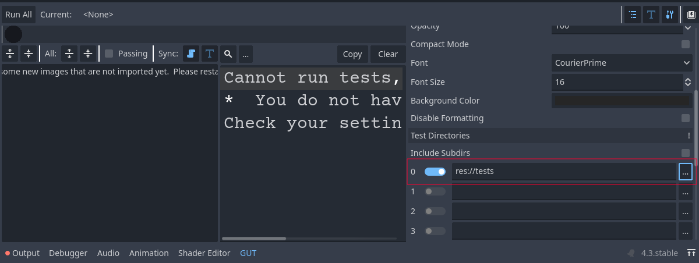
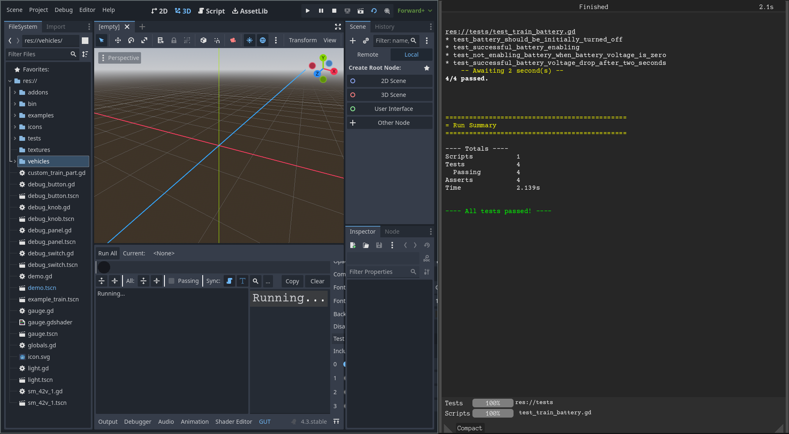

# MaSzyna-API-wrapper

## About the project

This C++ GDExtension for Godot Engine offers a simplified interface to the MaSzyna train simulator API. Tailored for the MaSzyna Reloaded project, it enables developers to construct train components using Godot's Node-based system, providing a visual and intuitive approach to train creation and management. Key features include:

- Custom Node-based Classes: Create train elements using our premade and integrated classes based on Godot's familiar Node system.
- Parameter Customization: Fine-tune train parameters directly within the Godot editor.
- Simplified Integration: Seamlessly integrate the MaSzyna simulator physics into your Godot projects.
- Enhanced Debugging: Streamline the debugging process for your train simulations.

### Setup

1. Install Python 3
2. Install scons using `pip install scons`
3. Install [MinGW-w64](https://mingw-w64.org/)
4. Clone the repository and checkout submodules

For a better reference see: for [windows](https://docs.godotengine.org/en/4.3/contributing/development/compiling/compiling_for_windows.html) and for [linux](https://docs.godotengine.org/en/4.3/contributing/development/compiling/compiling_for_linuxbsd.html)

```
git clone <url>
git submodule update --init --recursive
```

### Android development
#### Setup the build system   

1. Set the environment variable ANDROID_HOME to point to the Android SDK. If you downloaded the Android command-line tools, this would be the folder where you extracted the contents of the ZIP archive.

     - `Windows`: Press `Windows + R`, type "control system", then click on Advanced system settings in the left pane, then click on Environment variables on the window that appears.

     - `Linux` or `macOS`: Add the text `export ANDROID_HOME="/path/to/android-sdk"` to your `.bashrc` or `.zshrc` where `/path/to/android-sdk` points to the root of the SDK directories.

2. Accept licenses:
    ```cmd
    sdkmanager --licenses
    ```

3. Install dependencies as follows:
    ```cmd
    sdkmanager "platform-tools" "build-tools;34.0.0" "platforms;android-34" "cmdline-tools;latest" "cmake;3.10.2.4988404" "ndk;23.2.8568313"
    ```
For more detailed documentation, take a look at [official Godot Engine documentation for Android development](https://docs.godotengine.org/en/stable/contributing/development/compiling/compiling_for_android.html#setting-up-the-buildsystem)
### Compability

| Plugin Version | Godot Engine version | Windows | Linux | Mac OS | Android | iOS | C++ Standard | MaSzyna Version |
|----------------|----------------------|---------|-------|--------|---------|-----|--------------|-----------------|
| dev            | 4.3                  | ✅       | ✅       | ❌       | ✅       | ❌       | C++ 17       | 24.06 |

### Documentation

Project documentation: https://maszyna-reloaded.github.io/MaSzyna-API-wrapper/

If you have found any bug, have a suggestion or want to join us - feel free to open an [issue](https://github.com/MaSzyna-Reloaded/MaSzyna-API-wrapper/issues) or start a [discussion](https://github.com/MaSzyna-Reloaded/MaSzyna-API-wrapper/discussions)!

### Code Quality

#### Qodana
Files on PRs are scanned by Qodana. All it's reports are published [here](https://qodana.cloud/projects/ARjJ6)

### Testing

#### Testing locally

First, ensure you have checked out submodules:

```bash
git submodule update --init
```

Then run tests from the command line (if you have `make` installed, you can use shortcut `make run-tests`):

```bash
godot --path demo --headless -s addons/gut/gut_cmdln.gd -gdir=res://tests/ -gexit
```


Or use Godot Editor, but before that ensure you have configured test dirs.
GUT is storing the config in `user://` filesystem, so you have to do this manually.



Then run all tests:




#### Testing using docker

From the command line, build the image first:

```bash
docker build-t godot-tests .
```

then run the image:

```bash
docker run --rm godot-tests
```

If you have `make`, you can simply use the shortcut `make docker-run-tests`.
